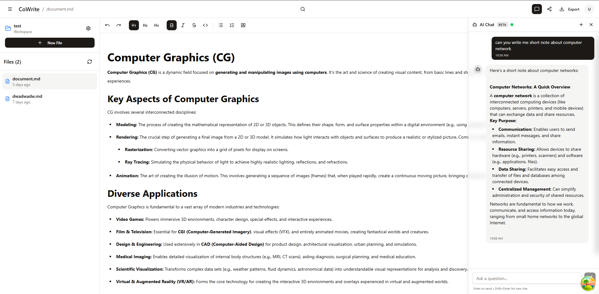
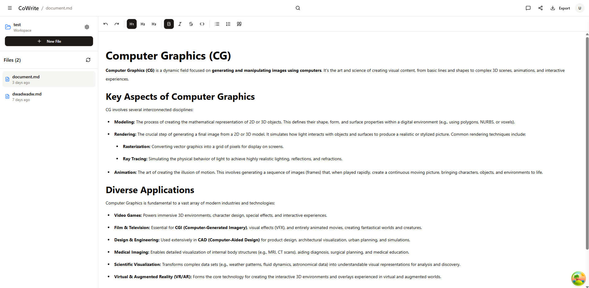
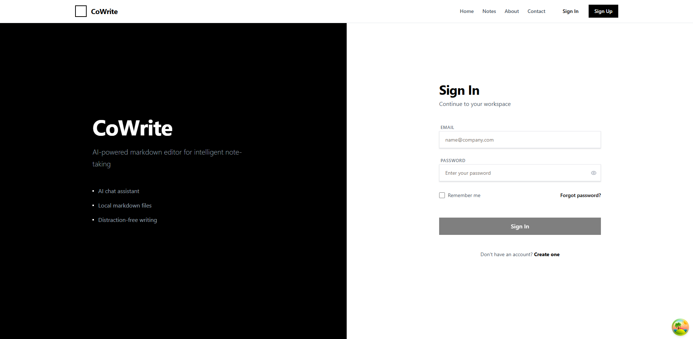

# CoWrite Web (Frontend)

The **CoWrite Web** is the frontend application for the **CoWrite** platform.  
It provides the user interface for interacting with AI-powered writing features, user management, and collaboration.

This project is built with **React**, styled with **Tailwind CSS**, and enhanced with modern tooling for scalability and developer experience.

## ⚙️ Tech Stack

- **React 18+**
- **Tailwind CSS** for styling
- **shadcn/ui** component library
- **React Query** for server state management
- **React Context** for global app state
- **WebSockets** for real-time AI responses
- **Prettier** for code formatting
- **ESLint** for linting and code quality

## 🛠️ Development

### Install dependencies

```bash
npm install
```

### Run the app

```bash
npm run dev
```

## ✅ Code Quality

```bash
npm run lint:fix
npm run format
```

## 📦 Build

```bash
npm run build
npm run preview
```

## 🔄 CI/CD (GitHub Actions + Docker Hub)

This project uses GitHub Actions to automate the following steps on each push and pull request:

Run lint checks (ESLint + Prettier)
Run build verification
Build a Docker image of the frontend
Push the Docker image to Docker Hub

This ensures that every commit merged into main is validated, tested, and available as a containerized image.

## 🖼️ Screenshots

Here are some preview images of the CoWrite Web application:

### Home


### Chat



### Dark Mode


### Notes



### Sign In



### Sign Up


